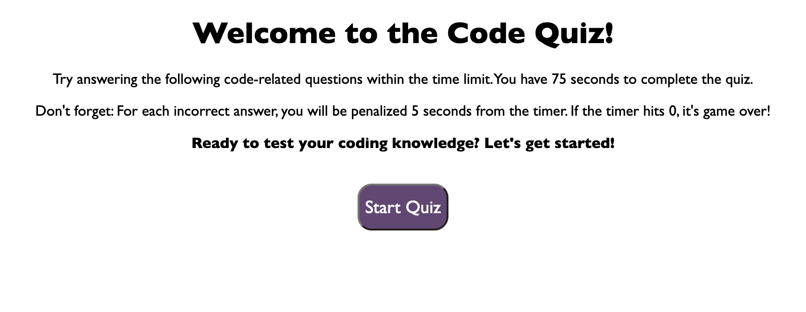
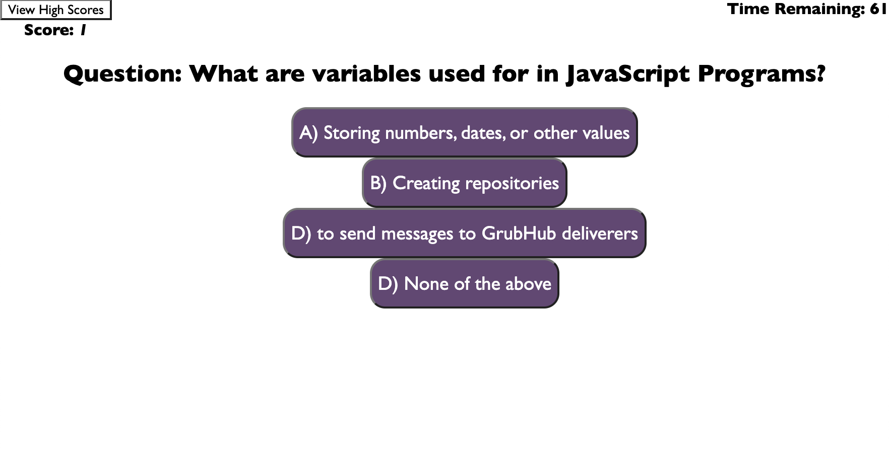

# Fun Web API Code Quiz!

## Goal

A multiple-choice timed quiz that runs within the browser, utilizing responsive, clean, and clear UI. When a question is recieved with a wrong answer, the timer will deduct time. When the question is correct, there will be points added. At the end of the quiz includes the option to add initials and see high scores. 

    Mock-Up Demo: 

## Installation

Deployed website can be found here: https://songbirdcode.github.io/CodeQuiz-WebAPIs/

## Usage

Languages used are: HTML, CSS, and JavaScript. 
JavaScript specific parts used are: DOM methods, timers, event listeners, client-side storage, as well as additional functions and arrays. All materials have been researched and utilized from materials within bootcamp as well as bootcamp classwork examples. 

All right reserved @ SongBirdCode

## Result

A functioning multiple choice quiz that starts once the player clicks the start button, when all the questions are answered or if the timer does reach zero, the game ends. When a question is presented and answered, the next question will follow, and finally the ability for the player to save their initials and reset the game. 

 Web Api Code Quiz results: 

 
 